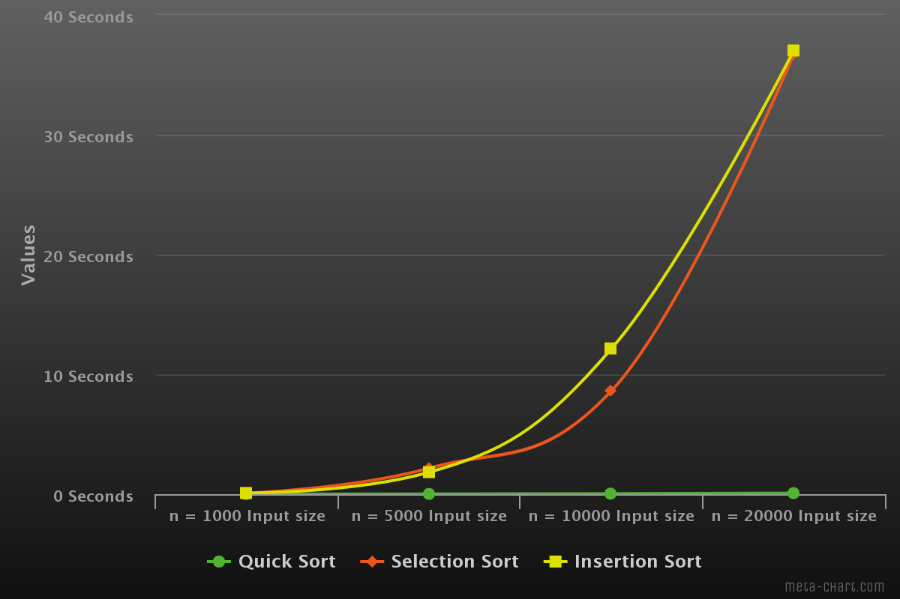

# sorting-algorithm-comparsions
Compares the running time of various sorting algorithms on given hardware

Example Plot of the Output Data Ran on a i7-7500U @ 3.5GHz

This program was written for an algorithms analysis course.

Dependecies:
  - Python 3

Installation:
  - Clone repo to local directory
  - Run sorts.py via Python 3
